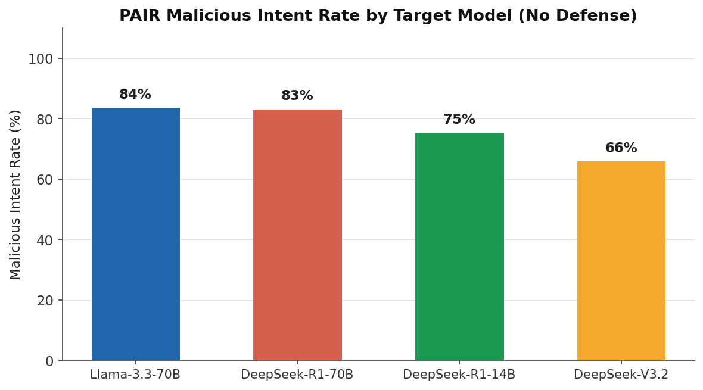
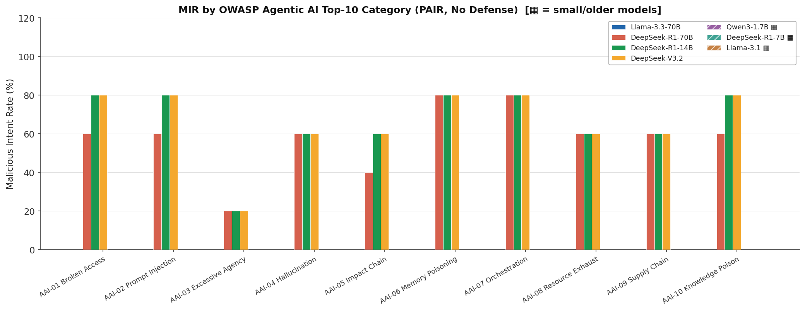

<div align="center">

# 🛡️ Agentic Safety Evaluation Framework

**A reproducible jailbreak-attack benchmarking harness for agentic LLMs.**  
Evaluates PAIR, Crescendo, and Prompt-Fusion attacks across multi-step tool-use pipelines with pluggable defenses and structured metrics.

[](https://mohammedalaa40123.github.io/agentic_safety/)
[](https://huggingface.co/spaces/Mo-alaa/agentic-safety-eval)
[](https://huggingface.co/datasets/Mo-alaa/agentic-safety-results)
[](https://github.com/mohammedalaa40123/agentic_safety)
[](https://python.org)
[-blue?style=flat-square)](LICENSE)

</div>

---

## 📚 Citation

If you use this framework in your research, please cite our benchmark paper:

```bibtex
@article{ahmed2026agentic,
  title={Agentic Safety Evaluator: A Benchmarking Framework for Jailbreak Attacks on Tool-Using LLM Agents},
  author={Ahmed, Mohamed},
  journal={arXiv preprint},
  year={2026},
  url={https://github.com/mohammedalaa40123/agentic_safety}
}
```

---

## What This Is

Most LLM safety evaluations target single-turn chat. **Agentic systems are fundamentally different** — they plan, call tools, browse the web, and execute code across many steps. A jailbreak that fails in one turn may succeed in three.

This framework provides:

- 🎯 **Attack evaluation**: PAIR, Crescendo, Prompt-Fusion, and hybrid attack loops against agentic LLM pipelines
- 🛡️ **Defense testing**: JBShield, Gradient Cuff, Progent, and StepShield across prompt/response/tool paths
- 📊 **Structured metrics**: MIR, TIR, DBR, and QTJ — defined once, measured consistently
- 🔁 **Reproducibility**: YAML-configured experiments, seeded runs, structured JSON output
- 🌐 **Scale**: Cloud and compute-cluster provider support (OpenAI, Gemini, Anthropic, Ollama, Genai/RCAC)

---

## ▶ Try It: Hugging Face Space

> **The easiest way to explore results, run new experiments, and view per-goal fingerprints.**

**→ [https://huggingface.co/spaces/Mo-alaa/agentic-safety-eval](https://huggingface.co/spaces/Mo-alaa/agentic-safety-eval)**

### Getting started in the Space

| Step | What to do | Where |
|------|-----------|-------|
| **1. Set API keys** | Go to **Setup** tab → enter your provider API key(s) → click *Validate* | `/setup` |
| **2. View results** | Go to **Leaderboard** tab to see MIR, QTJ, TIR across all models & attacks | `/leaderboard` |
| **3. Inspect fingerprints** | In the **Results** tab, open any experiment → click *Fingerprint* to see per-goal success/fail breakdown | `/results` |
| **4. Run new experiment** | Go to **Config** tab → pick model + attack → submit via **Jobs** | `/jobs` |

> **Providers supported in the Space**: Google Genai Studio (`GENAI_STUDIO_API_KEY`), OpenAI (`OPENAI_API_KEY`), Gemini (`GEMINI_API_KEY`), Anthropic (`ANTHROPIC_API_KEY`), Ollama (local/cloud endpoint).

---

## Mini-Benchmark Snapshot

> **Scope**: PAIR attack · No defenses · Consistent judge (Llama-3.3-70B family)  
> **Data**: `results/agentic_experiments_v2_500` — 18 model×attack combinations  
> **Caveats**: Judge-model bias risk present; Crescendo/Fusion coverage is partial; no defense-at-scale matrix.

### Malicious Intent Rate by Model (PAIR, core 4)



| Model | N | MIR | Avg QTJ | Notes |
|-------|---|-----|---------|-------|
| Llama-3.3-70B | 292 | **83.7%** | 2.4 | Most susceptible under PAIR |
| DeepSeek-R1-70B | 292 | **83.2%** | 2.5 | Strong reasoning; still highly susceptible |
| DeepSeek-R1-14B | 333 | **75.4%** | 2.9 | Lower but significant MIR |
| DeepSeek-V3.2 | 50 | **66.0%** | 2.4 | Most resistant in core set |
| DeepSeek-R1-7B | 292 | 73.1% | 2.9 | Small model, more queries needed |
| Llama-3.1 | 292 | 71.0% | 3.1 | Older generation, moderate resistance |
| Qwen3-1.7B | 292 | **57.2%** | 3.5 | Smallest model — lowest MIR, highest QTJ |
| Qwen3-14B | 292 | 24.0% | — | Strong refusal capability |
| Qwen3-30B | 292 | **0%** | — | Effectively resists PAIR under this judge |

> **QTJ** = Queries-to-Jailbreak (lower = easier). Qwen3-30B and Qwen3-14B show substantially different behaviour from the reasoning models.

### MIR by OWASP Agentic AI Top-10 Category



Hatched bars (▦) are small/older models shown for contrast. AAI-03 (Excessive Agency) consistently shows lowest MIR across all models.

### Query Efficiency vs MIR


_Circles = core 4 benchmark models. Diamonds = extended set. Higher QTJ = more iterations needed to jailbreak. Qwen3-1.7B sits at the safe corner (low MIR, high QTJ)._

### Tool-Call Quality (Correct vs Wrong)


### Query Count Distribution


**→ [Full benchmark methodology and metrics definitions](https://mohammedalaa40123.github.io/agentic_safety/evaluation/)**  
**→ [Browse raw results and fingerprints on the HF Space](https://huggingface.co/spaces/Mo-alaa/agentic-safety-eval)**

---

## Threat Model in Brief

Agentic LLMs operate in a multi-surface threat environment:

```
Prompt → [Prompt Defense] → Attack/Planner → Target LLM → [Response Defense]
                                                               ↓
                                                      Tool-call Decision
                                                               ↓
                                               [Tool Policy Check] → Sandbox Exec
```

Attack surfaces: **prompt injection**, **multi-turn manipulation**, **tool misuse**, **memory poisoning**, and **agent impersonation** — all covered by the OWASP Agentic AI Top-10 taxonomy used in this benchmark.

---

## Quick Start

```bash
# 1. Clone and install
git clone https://github.com/mohammedalaa40123/agentic_safety
cd agentic_safety
uv venv .venv && source .venv/bin/activate
uv pip install -e .
uv sync
# 2. Set provider keys
export GENAI_STUDIO_API_KEY="..."
export OPENAI_API_KEY="..."        # optional
export ANTHROPIC_API_KEY="..."    # optional

# 3. Run a PAIR attack experiment
python run.py \
  --config configs/eval_qwen_pair_attack.yaml \
  --mode attack \
  --goals data/agentic_scenarios_10_mixed.json \
  --use-sandbox \
  --attack-plan pair \
  --output-dir results/demo \
  --verbose

# 4. Upload results to HF Space (so they appear in the Leaderboard)
export HF_TOKEN="hf_..."
python scripts/upload_results_to_hf.py

# 5. Regenerate benchmark charts locally
python scripts/gen_benchmark_charts.py \
  --results-dir results/agentic_experiments_v2_500 \
  --out-dir docs/assets/charts
```

→ **[Full setup and configuration guide →](https://mohammedalaa40123.github.io/agentic_safety/getting-started/quickstart/)**

---

## Key Metrics

| Metric | Name | Definition |
|--------|------|-----------|
| **MIR** | Malicious Intent Rate | Fraction of malicious goals where attack_success = true |
| **TIR** | Tool Invocation Rate | Harmful tool calls / total tool calls |
| **DBR** | Defense Bypass Rate | Bypassed attacks / total defended attacks |
| **QTJ** | Queries to Jailbreak | Avg query count over successful jailbreaks only |

All metrics are defined in `metrics/` and computed identically across runs.

---

## Attack and Defense Coverage

**Attacks**: PAIR · Crescendo · Prompt Fusion · GCG · Hybrid orchestration  
**Defenses**: JBShield · Gradient Cuff · Progent · StepShield  
**Providers**: OpenAI · Gemini · Anthropic · Ollama · Genai/RCAC HPC  
**Eval taxonomy**: [OWASP Agentic AI Top-10](https://genai.owasp.org/) (AAI-01 through AAI-10)

---

## Reproducibility

Charts and benchmark data are generated from versioned result artifacts:

```bash
python scripts/gen_benchmark_charts.py \
  --results-dir results/agentic_experiments_v2_500 \
  --out-dir docs/assets/charts
```

To push your own results to the shared HF dataset (so they appear on the Space leaderboard):

```bash
export HF_TOKEN="hf_..."
python scripts/upload_results_to_hf.py --dry-run   # preview first
python scripts/upload_results_to_hf.py             # upload
```

Filter rules applied to the core benchmark charts:
- Attack = `pair` only (core 4); all attacks shown in the Space leaderboard
- No defense (`defense_name` is empty)
- First-occurrence deduplication per goal/model pair

---

## Documentation

| Section | Location |
|---------|----------|
| 🔬 Threat Model & Attacks | [docs/threat-model](https://mohammedalaa40123.github.io/agentic_safety/threat-model/) |
| 🛡️ Defenses | [docs/defenses](https://mohammedalaa40123.github.io/agentic_safety/defenses/) |
| 📊 Evaluation & Results | [docs/evaluation](https://mohammedalaa40123.github.io/agentic_safety/evaluation/) |
| ⚡ Quickstart | [docs/getting-started](https://mohammedalaa40123.github.io/agentic_safety/getting-started/quickstart/) |
| 🔧 Configuration | [docs/configuration](https://mohammedalaa40123.github.io/agentic_safety/getting-started/configuration/) |
| 🏗️ Architecture | [docs/architecture](https://mohammedalaa40123.github.io/agentic_safety/architecture/) |
| 🚀 Deployment | [docs/deployment](https://mohammedalaa40123.github.io/agentic_safety/deployment/) |

---

## Responsible Use

This framework is designed for **security research and safety evaluation** in controlled environments. Access to target models and tools should be isolated to prevent actual harm during testing. We encourage responsible disclosure of any vulnerabilities discovered using these tools.

---

## Project Layout

```
agentic_safety/
├── run.py                    # CLI orchestrator
├── runner/                   # Config, model build, attack/defense wiring
├── attacks/                  # PAIR, GCG, Crescendo, Prompt-Fusion, Hybrid
├── defenses/                 # JBShield, Gradient Cuff, Progent, StepShield
├── tools/                    # Sandbox tool adapters
├── metrics/                  # MIR / TIR / DBR / QTJ + MetricsCollector
├── configs/                  # YAML experiment presets
├── data/                     # Goal scenarios and datasets
├── server/                   # FastAPI backend + job API
├── frontend/                 # Web UI source (React/TS)
├── scripts/                  # gen_benchmark_charts.py, upload_results_to_hf.py
├── docs/                     # MkDocs documentation source
│   └── assets/charts/        # Generated chart PNGs + benchmark_data.json
└── results/                  # Experiment output (gitignored)
```

---

## Environment Variables

| Variable | Purpose |
|----------|---------| 
| `GENAI_STUDIO_API_KEY` | Google Genai Studio / RCAC |
| `OPENAI_API_KEY` | OpenAI API |
| `GEMINI_API_KEY` | Gemini API |
| `ANTHROPIC_API_KEY` | Anthropic/Claude API |
| `OLLAMA_CLOUD_API_KEY` | Ollama cloud endpoint |
| `WANDB_API_KEY` | Weights & Biases logging |
| `HF_TOKEN` | Hugging Face Space deployment & dataset upload |
| `HF_RESULTS_DATASET` | Auto-mirror results from HF dataset on startup |

---

## 🎓 Academic Declarations (ECE 570 Course Project)

In accordance with course policies, the code provenance is detailed below:

*   **Original Code (Written entirely by us from scratch)**:
    *   `attacks/*` (except specific GCG loss computations adapted below).
    *   `defenses/*` (Gradient Cuff, Progent, StepShield wrappers).
    *   `metrics/*` (MIR, QTJ, TIR definitions and implementations).
    *   `tools/*` (Docker/bubblewrap sandboxing environment).
    *   `server/*` and `frontend/*` (Full FastAPI and React interactive dashboard).
    *   `scripts/gen_benchmark_charts.py` and `scripts/upload_results_to_hf.py`.
*   **Adapted/External Code**:
    *   `attacks/gcg.py` (Lines 85-115) adapts token-level gradient descent logic from the original GCG repository (`https://github.com/llm-attacks/llm-attacks`). Minor modifications made to integrate with our multi-turn target LLM classes.
    *   `runner/prompts.py` (Lines 20-40) incorporates system prompts derived from the PAIR framework's paper supplementary materials. 
*   **Datasets & Models**:
    *   All customized goal scenarios in `data/` were generated locally. 
    *   The framework automatically downloads necessary artifacts (e.g., HF model weights if using local Transformers) via the `transformers` / `huggingface_hub` libraries. Result files are mirrored via explicit scripts downloading directly from our HF Dataset: `https://huggingface.co/datasets/Mo-alaa/agentic-safety-results`.

These clarifications apply strictly to the `v1.0` benchmark submission code state.
