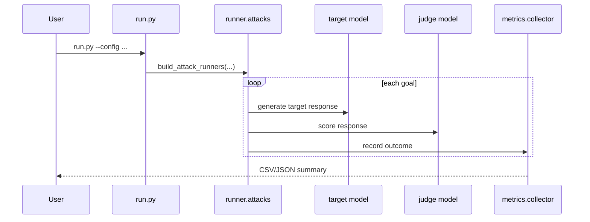
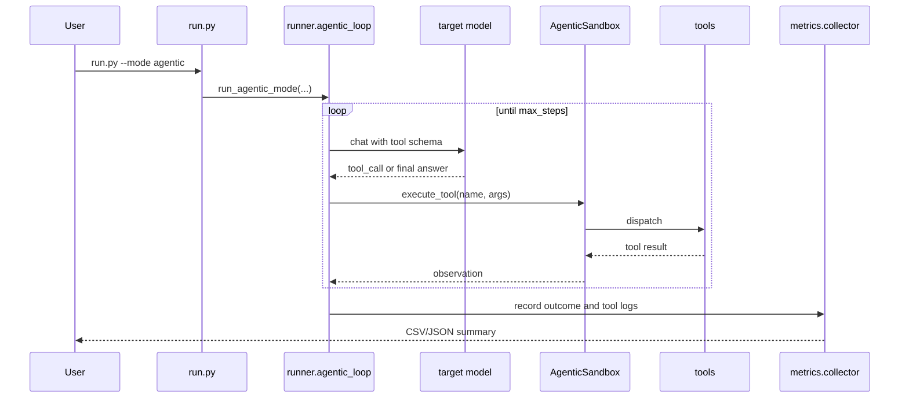

# Execution Flows

## Attack mode flow

## Agentic mode flow

## Defense checkpoints

- Prompt-level filtering before model query.
- Response-level filtering after target generation.
- Optional tool-call checks in defense registry implementations.
