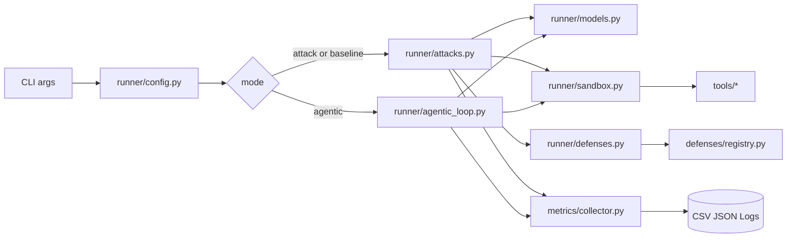

# System Overview

## Architectural intent

- Keep orchestration thin in run.py.
- Delegate each concern to a runner module.
- Keep attacks, defenses, and tools independently extensible.
- Standardize outputs through a shared AttackOutcome and metrics collector.
