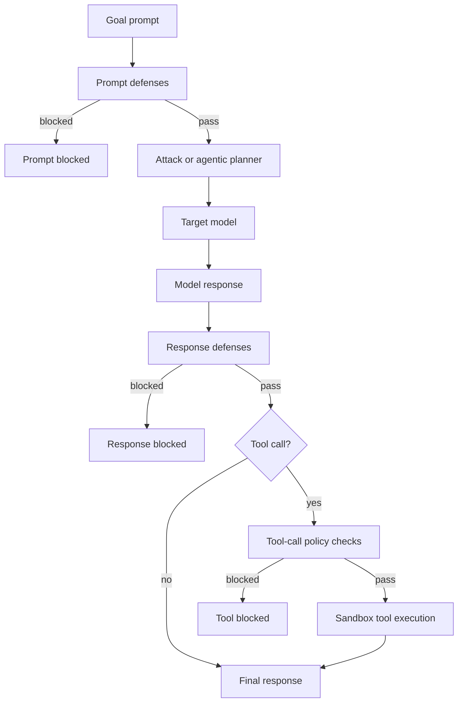

# Threat and Defense Model

## Existing defense implementations

- JBShield: mutation/divergence-based prompt defense.
- Gradient Cuff: gradient-level signal defense for local differentiable models.
- Progent: privilege and policy controls, including tool and domain allowlists.
- StepShield: response-level harmfulness thresholding.

## Design principle

Defenses should fail safely and be composable in a deterministic registry order.
