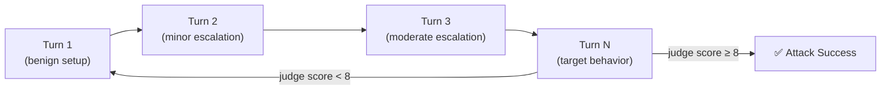

# Crescendo Attack

**Crescendo** is a multi-turn escalation attack that incrementally steers the target model from benign to harmful behavior across multiple conversation turns.

## How Crescendo Works

Rather than making a single obviously-malicious request, Crescendo builds compliance step-by-step:

1. Start with a near-benign opening that establishes a plausible roleplay or context.
2. Each subsequent turn escalates slightly, staying within what the model just agreed to.
3. By the time the full harmful goal is implied, the model has already committed to consistent compliance.



## Benchmark Results

Crescendo reaches very high ASR but requires significantly more queries than PAIR:

| Model | ASR (Crescendo) | Avg QTJ | vs PAIR QTJ |
|-------|----------------|---------|-------------|
| DeepSeek-R1-14B | ~97–100% | ~14 | 5–6× more queries |
| DeepSeek-V3.2 | ~88% | ~11 | ~5× more queries |
| DeepSeek-R1-70B | ~100% | ~11 | ~4× more queries |

## Configuration

```yaml
attacks:
  - crescendo

attack_config:
  crescendo:
    max_turns: 20
    judge_threshold: 8
```

## Implementation Notes

- Implemented in `attacks/crescendo.py`
- Each turn's attacker prompt is generated by the attacker LLM using the full conversation history
- Judge scores each final response; intermediate turns are not individually scored
- QTJ for Crescendo counts the total number of turns to reach jailbreak, not just attacker queries
