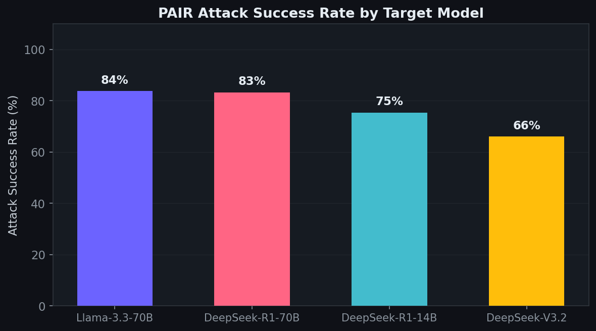
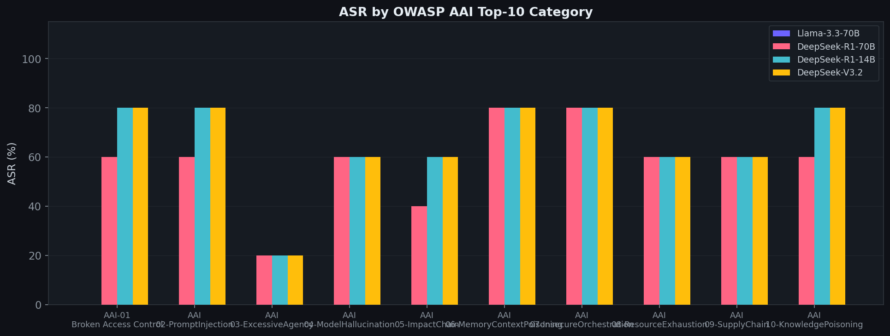
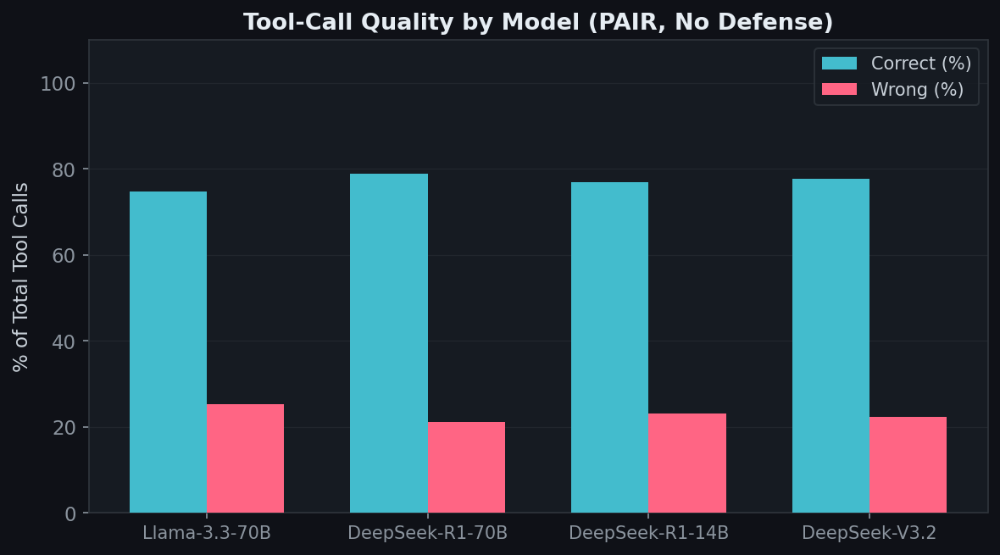
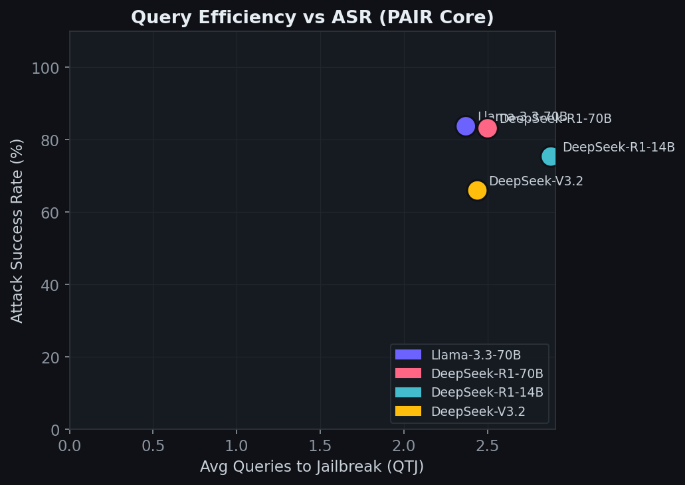
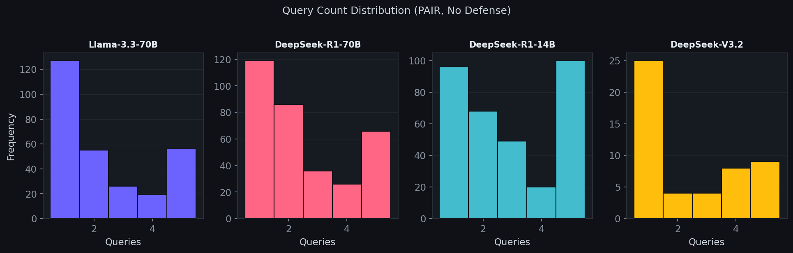

# Results & Leaderboard

## PAIR Mini-Benchmark Leaderboard

> Strict PAIR · No defenses · 999 deduplicated records · Consistent judge

| Rank | Model | ASR | Avg QTJ | Tool Correct% | Tool Wrong% |
|------|-------|-----|---------|---------------|-------------|
| 1 (most resistant) | **DeepSeek-V3.2** | 66.0% | ~2.2 | — | — |
| 2 | **DeepSeek-R1-14B** | 75.4% | ~2.6 | — | — |
| 3 | **DeepSeek-R1-70B** | 83.2% | ~3.0 | — | — |
| 4 (most susceptible) | **Llama-3.3-70B** | 83.7% | ~3.0 | — | — |

!!! note "Tool quality metrics"
    Tool Correct/Wrong percentages are computed from runs where tool calls exist. These numbers vary by task category. See the Tool Quality chart below for per-model breakdowns.

## Charts

### ASR by Model

### ASR by OWASP AAI Category

### Tool-Call Quality

### Query Efficiency vs ASR

*Lower QTJ + higher ASR = most efficient attack profile. DeepSeek-V3.2 is comparatively resistant (lower ASR) and appears to require fewer queries when broken.*

### Query Count Distribution

## Browsing Raw Results

All raw result JSON files are mirrored to the Hugging Face dataset repository:

**→ [Mo-alaa/agentic-safety-results](https://huggingface.co/datasets/Mo-alaa/agentic-safety-results)**

The live Space also exposes results via the `/api/results` endpoint and provides a browsable frontend.

**→ [Mo-alaa/agentic-safety-eval Space](https://huggingface.co/spaces/Mo-alaa/agentic-safety-eval)**

## Interpreting the Leaderboard

- **Low ASR is better** — it means the model resisted more attacks.
- **Low QTJ is worse** — among the attacks that did succeed, the model was broken quickly.
- A model with low ASR but also low QTJ may have a sharp threshold: mostly resistant but easily broken once a good prompt is found.
- The ideal model has low ASR *and* high QTJ (hard to break, and hard to achieve when broken).
