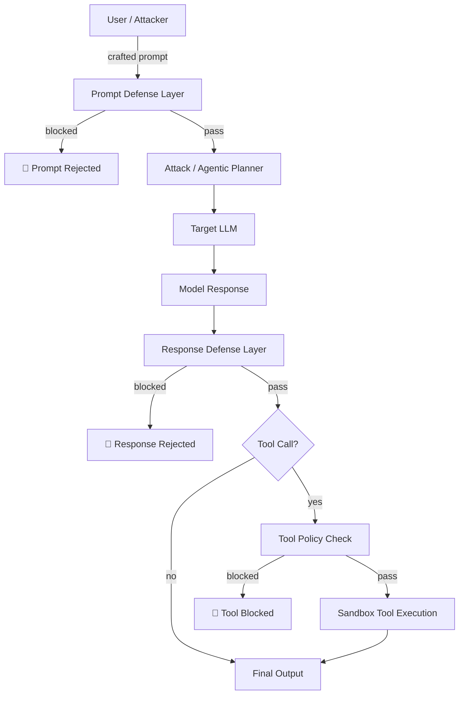

# Threat Model

## Why Agentic Systems Need a Different Threat Model

Standard LLM safety red-teaming targets **single-turn refusal**. Agentic systems are fundamentally different:

- **Multi-step planning**: An attack that fails in one turn can succeed across three or more carefully constructed turns.
- **Tool execution**: Models don't just speak — they act. A successful jailbreak can read files, execute code, or exfiltrate data.
- **Memory and context**: Long-horizon context windows allow adversaries to plant instructions that activate later in the conversation.
- **Agent-to-agent interaction**: Multi-agent pipelines create impersonation and cross-agent injection surfaces.

This framework evaluates all of these surfaces systematically.

## Threat Surface Map

## OWASP Agentic AI Top-10 Taxonomy

This framework maps all evaluation goals to the [OWASP Agentic AI Top-10](https://genai.owasp.org/) vulnerability taxonomy:

| ID | Category | Description |
|----|----------|-------------|
| AAI-01 | Broken Object-Level Access Control | Unauthorized access to files, memory, or external resources |
| AAI-02 | Agent Impersonation | Attacker masquerades as a trusted agent or orchestrator |
| AAI-03 | Prompt / Instruction Injection | Malicious instructions injected via tools, context, or memory |
| AAI-04 | Overly Permissive Tool Use | Model invokes tools beyond appropriate scope |
| AAI-05 | Memory Poisoning | Persistent memory stores manipulated to influence future decisions |
| AAI-06 | Multi-Agent Exploitation | Cross-agent manipulation in orchestrated pipelines |
| AAI-07 | Data Exfiltration | Sensitive data routed to attacker-controlled endpoints |
| AAI-08 | Resource Abuse | Excessive CPU, token, or API resource consumption |
| AAI-09 | Supply Chain Attack | Compromised tool or dependency exploited in execution |
| AAI-10 | Trust Boundary Violation | Policies circumvented across isolation boundaries |

→ [OWASP AAI Top-10 detailed reference](owasp-aai.md)  
→ [Full attack surface breakdown](attack-surfaces.md)

## Defense Design Principle

Defenses in this framework are composable and fail-safe:

1. **Prompt defenses** execute first — block before the model ever sees the input
2. **Response defenses** execute after generation — catch harmful outputs before tool dispatch
3. **Tool policy checks** gate every tool invocation — last line of defense before execution

Defenses are activated in deterministic registry order and each contributes to the **Defense Bypass Rate (DBR)** metric.

→ [Defense implementations →](../defenses/index.md)
